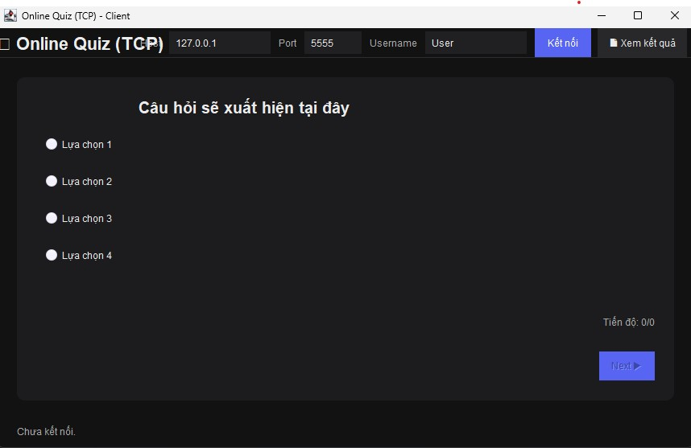

<h2 align="center">
    <a href="https://dainam.edu.vn/vi/khoa-cong-nghe-thong-tin">
    🎓 Faculty of Information Technology (DaiNam University)
    </a>
</h2>
<h2 align="center">
   Ứng dụng trắc nghiệm trực tuyến
</h2>
<div align="center">
    <p align="center">
        
        
        
    </p>

[](https://www.facebook.com/DNUAIoTLab)
[](https://dainam.edu.vn/vi/khoa-cong-nghe-thong-tin)
[](https://dainam.edu.vn)

</div>

## 📖 1. Giới thiệu
Ứng dụng Trắc nghiệm trực tuyến Client–Server được phát triển bằng Java, dựa trên giao thức TCP để đảm bảo việc trao đổi dữ liệu tin cậy và chính xác.
Hệ thống cho phép sinh viên/kỹ thuật viên kết nối tới server, thực hiện làm bài trắc nghiệm, và nhận kết quả ngay sau khi hoàn thành.


Các chức năng chính: 
1. Client kết nối đến server qua địa chỉ IP và port (mặc định: 5555). Server hỗ trợ nhiều client đồng thời thông qua cơ chế đa luồng, và yêu cầu người dùng nhập tên để xác định danh tính.
2. Gửi và nhận câu hỏi – đáp án: Server gửi các câu hỏi trắc nghiệm đến client. Người dùng chọn đáp án, gửi về server; server kiểm tra và phản hồi kết quả đúng/sai theo thời gian thực.


## 🔧 2. Công nghệ sử dụng


## 🚀 3. Các project đã thực hiện

<p align="center">
  
</p>

<p align="center">
  <em>Hình 1: Giao diện khi vào ứng dụng  </em>
</p>

<p align="center">
  
</p>
<p align="center">
  <em> Hình 2: Client sau khi kết nối sever</em>
</p>


<p align="center">
  
 
</p>
<p align="center">
  <em> Hình 3: Sau khi làm xong bài  </em>
</p>

<p align="center">
    
</p>
<p align="center">
  <em> Hình 4: Kết quả sau khi lưu trữ </em>
</p>

## 📝 4. Hướng dẫn cài đặt và sử dụng

### 🔧 Yêu cầu hệ thống

- **Java Development Kit (JDK)**: Phiên bản 8 trở lên
- **Hệ điều hành**: Windows, macOS, hoặc Linux
- **Môi trường phát triển**: IDE (IntelliJ IDEA, Eclipse, VS Code) hoặc terminal/command prompt
- **Bộ nhớ**: Tối thiểu 512MB RAM
- **Dung lượng**: Khoảng 10MB cho mã nguồn và file thực thi
- **Mạng**: Yêu cầu kết nối mạng nội bộ hoặc Internet để client và server giao tiếp qua TCP

### 📦 Cài đặt và triển khai

#### Bước 1: Chuẩn bị môi trường

1. **Kiểm tra Java**: Mở terminal/command prompt và chạy:

   ```bash
   java -version
   javac -version
   ```
   Đảm bảo cả hai lệnh đều hiển thị phiên bản Java 8 trở lên.

2. **Tải mã nguồn**: Sao chép thư mục `UngDungTracNghiem_TCP` chứa các file:
   - `QuizServer.java`
   - `QuizClientSwing.java`
   - `Question.java`
   - `ResultsViewerSwing.java`

#### Bước 2: Biên dịch mã nguồn

1. **Mở terminal** và điều hướng đến thư mục chứa mã nguồn
2. **Biên dịch các file Java**:

   ```bash
   javac quiz/*.java
   ```
   Hoặc biên dịch từng file riêng lẻ:
   ```bash
    javac quiz/QuizServer.java
    javac quiz/QuizClientSwing.java
    javac quiz/Question.java
    javac quiz/ResultsViewerSwing.java
   ```

3. **Kiểm tra kết quả**: Nếu biên dịch thành công, sẽ tạo ra các file `.class` tương ứng.

#### Bước 3: Chạy ứng dụng

**Khởi động Server:**
```bash
java QuizServer.java
```
- Server sẽ khởi động trên port mặc định (5555)
- Console sẽ hiển thị log khi có client kết nối.
- Server sẽ tạo (nếu chưa có) file results.csv để lưu kết quả làm bài.

**Khởi động Client:**
```bash
java QuizClientSwing.java
```
- Mỗi client được mở trong một terminal/ứng dụng riêng.
- Nhập Host, Port và Username trên giao diện Swing.
- Client kết nối đến server và bắt đầu nhận câu hỏi trắc nghiệm.
- Sau khi hoàn thành, điểm số và kết quả sẽ được hiển thị ngay trên giao diện.
- Người dùng có thể chọn 📄 Xem kết quả để mở bảng thống kê kết quả từ file results.csv.

### 🚀 Sử dụng ứng dụng

1. **Kết nối**: Nhập Host, Port và Tên người dùng → bấm Kết nối để tham gia thi.
2. **Làm bài**: Chọn đáp án cho từng câu hỏi và nhấn Next/Finish.
3. **Phản hồi**: Sau mỗi câu, giao diện hiển thị kết quả đúng/sai và tiến độ.
4. **Kết quả cuối cùng**: Khi hoàn thành, client hiển thị điểm số và thống kê.
5. **Lưu trữ**: Server tự động lưu kết quả vào file results.csv.
6. **Xem lại**: Người dùng có thể nhấn 📄 Xem kết quả để mở bảng thống kê từ file.
7. **Ngắt kết nối**: Đóng cửa sổ client hoặc mất mạng sẽ tự động ngắt kết nối.

## Thông tin cá nhân
**Họ tên**: Nguyễn Hoàng Liêm.  
**Lớp**: CNTT 16-03.  
**Email**: liemnguyenhoang22@gmail.com.

© 2025 AIoTLab, Faculty of Information Technology, DaiNam University. All rights reserved.

---